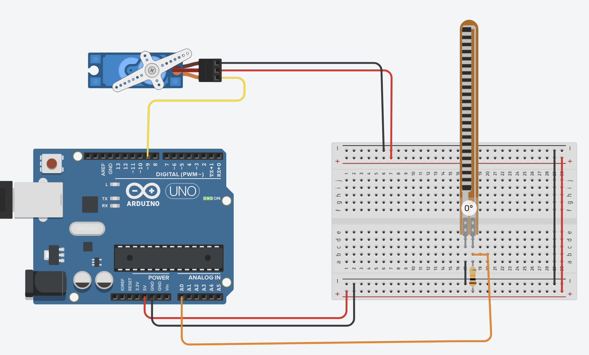

# Six-Axis Gesture-Controlled Robotic Arm

## Progress to Date
- Completed 3D printing of all robotic arm components based on the reference design.
- Prepared inventory of printed parts and hardware required for assembly.

## Week 1 Update
After receiving STEC approval and access to the project budget, I ran into a roadblock: figuring out exactly what components to buy. Since I must use approved sources, I’ve been overthinking what’s actually necessary for the prototype.  
For example, I’m unsure if countersunk screws are essential, or if roundhead screws will work for most of the arm structure.  

**Goal for Week 1:**  
- Remake the parts/equipment spreadsheet with items from approved sources.  
- Purchase the required products to begin physical assembly.  
- Consider buying screw sets (e.g., M3/M4 kits) to account for variations in size during prototyping.  

## Next Steps
1. Assemble the 3D-printed components into the full arm structure.
2. Install servo motors, screws, and mechanical fasteners.
3. Build the gesture-sensing glove and integrate flex sensors and an accelerometer.
4. Test and verify Bluetooth communication between the glove and robotic arm.
5. Program the Arduino to enable real-time gesture-based control.

## Sept 12 Research Stand-up

**Goal**  
- Get the flex sensor to control a servo motor.  
- ✅ Achieved basic control, modification and refinement strongly suggested for better responsiveness.

**Progress / Done Well**  
- Established working wiring between flex sensor (voltage divider) and Arduino.  
- Servo responds to flex sensor input.  
- Verified calibration ranges (~940, 960, 980) as reference points.  

**Roadblocks**  
- Calibration of flex sensor remains inconsistent.  
- Servo behavior limited due to using continuous-rotation type (positional servo would be more suitable for robot arm).  
- Fine-tuning thresholds and smoothing still needed.  

**Next Steps**  
- Add calibration routine for flex sensor (auto-detect min/max).  
- Explore swapping to positional servos for precise robot arm movement.  
- Begin integration planning for glove interface.
- Assemble parts once screws have been delivered 
- Queue 3D prints of glove prototype at GGC Digital Lab.  

**Circuit Reference**  

## Reference Resource
This project is based on the following reference tutorial:  
**DIY Arduino Robot Arm Controlled by Hand Gestures – SmartBuilds.io**  
[https://smartbuilds.io/diy-robot-arm-arduino-hand-gestures/](https://smartbuilds.io/diy-robot-arm-arduino-hand-gestures/)
